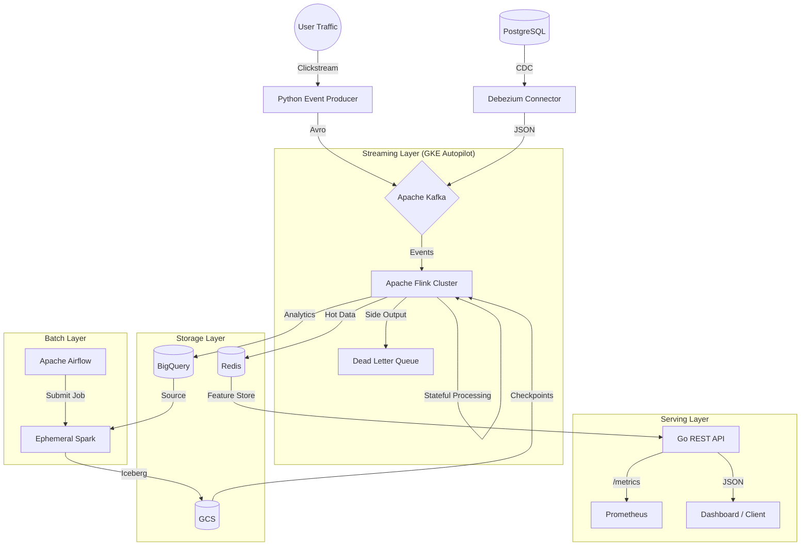

# 🚀 StreamForge: High-Throughput E-Commerce Analytics Platform

StreamForge is a **production-grade, event-driven data platform** designed to process high-velocity e-commerce traffic. It demonstrates an end-to-end data lifecycle: from CDC ingestion to stateful stream processing, batch aggregation, and low-latency serving.

This project implements architectural patterns commonly found in high-scale environments, prioritizing **fault tolerance**, **observability**, and **infrastructure-as-code**.

> 💡 **Not a tutorial project.** This repository tackles real production challenges including Dead Letter Queues, Session Windows with late data handling, and GitOps deployment patterns.

---

## 🏗️ Architecture

The platform follows the **Kappa Architecture** (streaming-first) with a supplementary batch layer for reconciliation and historical aggregations.



---

## 🎯 Key Engineering Patterns

This repository goes beyond "Hello World" to tackle real production challenges:

### 1. Advanced Stream Processing (Flink)

| Pattern | Implementation |
|---------|---------------|
| **Complex Event Processing (CEP)** | Temporal fraud detection: "3 orders > ₺5000 within 5 minutes" using FlinkCEP state machines |
| **Session Windows** | Dynamic 30-minute session gaps with watermarks for late-arriving data |
| **Dead Letter Queue** | Poison pill data routed to `dlq.fraud-detector` topic via Side Outputs—pipeline never crashes |
| **State Management** | RocksDB backend with incremental checkpointing to GCS |

```java
// Dead Letter Queue Pattern - Route bad data instead of crashing
ctx.output(DLQ_TAG, formatDlqMessage(json, e.getMessage()));
```

### 2. High-Performance Serving (Go)

| Feature | Implementation |
|---------|---------------|
| **Microservice Architecture** | Dedicated Go REST API serving computed features from Redis |
| **Multi-stage Docker** | Lightweight `<20MB` scratch containers for rapid K8s scaling |
| **Generics** | Go 1.21+ generics for type-safe `APIResponse[T]` |
| **Observability** | Prometheus metrics instrumentation (RED method) |

```go
// RED Method - Rate, Errors, Duration
httpRequestDuration.WithLabelValues(method, endpoint).Observe(duration)
```

### 3. Observability & Reliability

| Concern | Solution |
|---------|----------|
| **Metrics** | Prometheus `/metrics` endpoint with request latency histograms |
| **Fault Tolerance** | DLQ for streaming, validation gates in Airflow DAGs |
| **Data Quality** | Avro schemas in Schema Registry enforce contracts |
| **Debugging** | DLQ exports with original message + error context |

### 4. GitOps & Infrastructure

| Practice | Implementation |
|----------|---------------|
| **Infrastructure as Code** | Full GCP (GKE, BigQuery, GCS) in Terraform |
| **Security** | Workload Identity for keyless GCP access from pods |
| **Helm Charts** | Parameterized Flink deployments for Dev → Staging → Prod |
| **Storage Lifecycle** | Auto-cleanup: checkpoints (7d), DLQ (30d), Nearline transition |

---

## 🛠️ Technology Stack

| Domain | Technology | Usage |
|--------|-----------|-------|
| **Ingestion** | Debezium, Kafka Connect | CDC from PostgreSQL; Schema Registry for Avro evolution |
| **Streaming** | Apache Flink 1.18 (Java/Scala) | Stateful processing, Windowing, CEP, Side Outputs |
| **Serving** | Go 1.21, Redis | Low-latency REST API with Prometheus metrics |
| **Batch** | PySpark, Apache Iceberg | Daily reconciliation and historical aggregations |
| **Orchestration** | Apache Airflow | Ephemeral Dataproc cluster lifecycle management |
| **Infrastructure** | Terraform, GKE Autopilot | Cloud-native, serverless Kubernetes |
| **Deployment** | Helm, Docker | Multi-stage builds, parameterized charts |

---

## 📂 Project Structure

```
streamforge/
├── api/                      # Go REST API (Serving Layer)
│   ├── main.go               # Handlers + Prometheus middleware
│   ├── Dockerfile            # Multi-stage build
│   └── go.mod
├── cdc/                      # Change Data Capture
│   ├── init-db.sql           # PostgreSQL schema + sample data
│   ├── postgres-connector.json
│   └── register-connector.ps1
├── charts/                   # Helm Charts
│   └── streamforge-flink/    # Templated K8s deployment
│       ├── values.yaml       # Environment overrides
│       └── templates/
├── dags/                     # Airflow DAGs
│   └── daily_analytics_dag.py
├── flink-jobs/               # Stream Processing (The Brain)
│   ├── src/main/java/        # FraudDetector, SessionAggregator, RevenueCalculator
│   ├── src/main/scala/       # CdcEventProcessor
│   └── src/test/java/        # Unit tests with TestHarness
├── infrastructure/terraform/ # GCP Infrastructure
│   ├── main.tf
│   ├── gke.tf                # GKE Autopilot + Workload Identity
│   ├── bigquery.tf           # Analytics tables
│   └── storage.tf            # GCS with lifecycle rules
├── producer/                 # Traffic Simulator
│   └── src/simulator.py      # Avro events → Kafka
└── spark/                    # Batch Processing
    └── jobs/daily_aggregations.py
```

---

## 🚀 Quick Start

### Local Development (Docker Compose)

Spin up the entire stack locally:

```bash
# 1. Start infrastructure (Kafka, Flink, Redis, PostgreSQL)
docker-compose up -d

# 2. Register Debezium CDC connector
./cdc/register-connector.ps1

# 3. Build Flink jobs
cd flink-jobs && mvn clean package

# 4. Generate synthetic traffic (50 events/sec)
python producer/src/simulator.py --rate 50

# 5. Start Go API
cd api && go run main.go
```

### Access Points

| Service | URL |
|---------|-----|
| Kafka UI | http://localhost:8080 |
| Flink Dashboard | http://localhost:8082 |
| Go API | http://localhost:8090/api/v1/health |
| Prometheus Metrics | http://localhost:8090/metrics |

### Kubernetes Deployment (GKE)

Deploy to Google Cloud using Terraform and Helm:

```bash
# 1. Provision GCP Infrastructure
cd infrastructure/terraform
terraform init && terraform apply

# 2. Deploy Flink via Helm
helm install streamforge-flink ./charts/streamforge-flink \
  --set environment=production \
  --set taskmanager.replicas=4
```

---

## 🧪 Testing Strategy

Quality is enforced at multiple levels:

| Level | Approach |
|-------|----------|
| **Unit Tests** | Flink `KeyedProcessFunction` tested with `KeyedOneInputStreamOperatorTestHarness` |
| **Integration** | End-to-end: Kafka → Flink → Redis sink validation |
| **Data Contracts** | Avro schemas in Schema Registry enforce producer/consumer compatibility |
| **Data Quality** | Airflow DAGs validate row counts and null checks before marking success |

```bash
# Run Flink unit tests
cd flink-jobs && mvn test
```

---

## 📊 Monitoring

The platform exposes metrics for Prometheus scraping:

### Flink Metrics
- `flink_jobmanager_job_uptime` - Job health
- `flink_taskmanager_numRecordsIn` - Throughput
- Checkpoint duration and size

### Go API Metrics (RED Method)
- `streamforge_http_requests_total` - Request rate by endpoint
- `streamforge_http_request_duration_seconds` - Latency histogram (p50, p95, p99)
- `streamforge_redis_errors_total` - Backend failures

### Sample Prometheus Query
```promql
# P99 latency for fraud-alerts endpoint
histogram_quantile(0.99, 
  rate(streamforge_http_request_duration_seconds_bucket{endpoint="/api/v1/fraud-alerts"}[5m])
)
```

---

## 🔴 Live Demo

| Resource | URL | Status |
|----------|-----|--------|
| **Flink Dashboard** | [http://35.205.241.21](http://35.205.241.21) | ✅ Live |
| **GCP Console** | [console.cloud.google.com](https://console.cloud.google.com/home/dashboard?project=trendstream-portfolio-2026) | ✅ Live |
| **BigQuery** | [Dataset](https://console.cloud.google.com/bigquery?project=trendstream-portfolio-2026) | ✅ Live |

---

## 🛠️ Challenges & Solutions

| Challenge | Solution |
|-----------|----------|
| **Poison pill data crashing Flink** | Implemented DLQ pattern with Side Outputs |
| **Late-arriving events** | Watermarks with 10s bounded out-of-orderness |
| **GCP IAM race condition** | Added `depends_on` in Terraform for Workload Identity |
| **Windows port conflicts** | Remapped Kafka to 29092 in Docker Compose |
| **Schema evolution** | Avro + Schema Registry with compatibility checks |

---

## 👤 Author

**Kaan Guner**  
Senior Data Engineer

[](https://github.com/kaanguner)
[](https://linkedin.com/in/kaanguner)

---

## 📄 License

MIT License - See [LICENSE](LICENSE)
